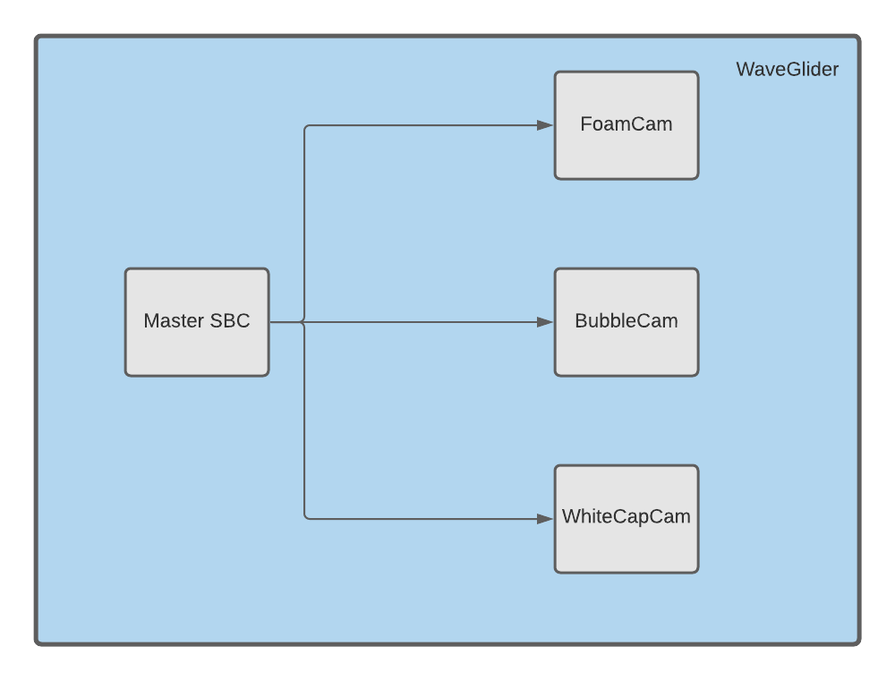

# WaveGlider Communications System

This repository is used to implement the network programming needed for the 
WaveGlider system to acquire images. Currently the cSBC file is configured for 
BubbleCam, but can be easily modified for other cameras.

<p align="center">
    
</p>

## Deployment

* Confirm the camera is connected to the USB 3.0 port on the SBC, and the manual
settings on the camera lense are correct.
* For development, the two files below can be executed on the same SBC in
different terminals. This is done by setting the `HOST` constant in the 
`./config/mSBC_config.py` file to `127.0.0.1`. 
* For production, follow the same
processes below except set the `HOST` constant in the 
`./config/mSBC_config.py` file to the cSBC's ip address.


### cSBC
1. Open a new terminal

2. Confirm you are in the `spinnaker_py37` conda environment.

3. Execute the following command to begin acquiring images and receiving 
connections.
    ```
    python cSBC.py
    ```


### mSBC
1. Open a new terminal

2. Confirm you are in the `spinnaker_py37` conda environment.

3. Execute the following command to begin sending commands to the cSBC.
    ```
    python mSBC.py
    ```


## How It Works
The current system functions by using two main files, `cSBC.py` and `mSBC.py`.
`cSBC.py` should be run on the SBC that has the camera connected to it as it
listens for commands from the `mSBC`. `mSBC.py` can either be run on the same
SBC or a different one, but the server's IP address must be specified in the 
mSBC config file if it is not localhost.

Both files contain config files in the `config` directory. In those files, all
settings for the system and camera will be defined for their respective file.

### cSBC
The `cSBC.py` file utilizes multiprocessing and socket programming
to run it's two functions in parallel: capture images and listen for commands. 
Upon execution of the program, the cSBC will begin capturing images in a rolling
buffer of a predetermined size. It will continue capturing images keep the most 
recent images in the buffer by removing the oldest and inputting the newest. 
Upon execution of the program it is also listening for commands from the mSBC. 
If an event occurs, the cSBC will stop accepting new connections and begin 
writing all the current images in the rolling buffer to disk in a timestamped 
directory. Once completed, the cSBC opens back up for new connections and 
begins capturing images. If no event occurs, the cSBC continues to capture 
images in memory in the rolling buffer. If it receives the shutdown command, it
will close all connections, stop listening for new ones, stop saving images to 
the rolling buffer, and terminate the program. There are other commands defined
for the cSBC as well for different information about the system.

### mSBC
The `mSBC.py` file utilizes socket programming to send command to the cSBC and
receive data. It currently takes user input and decodes that input to send the
correct command, but in the future these will be sent automatically as they
will be triggered by sensors on board the WaveGlider.


## Testing
All tests are contained within the `tests` directory. Please navigate into the
`tests` directory first before running any tests. All tests inherit their camera
settings from the `camera_config.py` file. Please set your camera settings in
that file before running any tests. All results from running the file 
`testbench.sh` will be stored in a timestamped file in the `results` directory.
Each test recreates it's own image directory to store the images captured so you
can refer to those to see the actual images.

Run these tests to have a GUI window with the camera view pop up.
- To display a single image run `test_capture_single_image.py`.
- To display a video stream run `test_video.py`.

Run the following command below to automatically run all the following tests. They can
also be run individually. Remember that all these tests inherit their camera
settings from the `camera_config.py` file. Please set your camera settings in
that file before running any tests.
```
sh testbench.sh
```
* `test_compression_size.py`
* `test_event_delay.py`
* `test_frame_rate.py`
* `test_write_speed.py`

Run the following test to confirm the cSBC's ability to handle rapid sequential
events.
```
# in a new terminal 
python cSBC.py
# in a new terminal 
python test_send_rapid_events.py
```
Run the following test to set the FPS for your camera and confirm the previous 
FPS.
```
test_set_frame_rate.py
```

The following tests need to be run physically:
* Hard Drive Connection Test: How many can we connect to the device?
* Hard Drive Max Storage Test: What is the max storage per hard drive?
* Up-Time Test: Test how long the system can run with no issues?
* LP Heat Test: How hot does the LP get?
* Power Consumption Test: How much power does the system consume?


## Logging
The two files `cSBC.py` and `mSBC.py` log their activity to their log files
in the `logs` directory. The information that gets logged is defined in the
files themselves. The way information gets logged and at what level of 
importance is defined in the `config` directory in their configuration files. If
you would like to log more or less information, add more log statements in
the two files or change the level of the log statements.

This [link](https://docs.python.org/3/library/logging.html#logrecord-attributes) 
contains all of the attributes that can be logged in one call to log.


## Configuration
All the configuration for the `cSBC.py` and `mSBC.py` files are defined in the
`config` directory. Please refer to this file to define new configuration
settings for the following: camera, server, logging, data transfer format.

This [link](https://docs.opencv.org/2.4/modules/highgui/doc/reading_and_writing_images_and_video.html#videocapture-set) 
contains all of the camera settings that can be set using OpenCV.


## Defining New Commands
As of right now, new commands are handled in the files in the `config` directory
and also in the files `cSBC.py` and `mSBC.py`. The most important thing in this
section is to make sure that the command the mSBC is sending is exactly what
the cSBC is expecting.

### cSBC
To define a new command in for the cSBC, follow these steps.
1. In the `config/cSBC.config.py` file, define the constant variable for the
command and its response for to the mSBC.
2. In the `performCommand()` function in `cSBC.py`, add a case for the command,
and in that case perform the necessary steps to execute it as well as respond
to the mSBC.

### mSBC
To define a new command in for the mSBC, follow these steps.
1. In the `config/mSBC.config.py` file, define the constant variable for the
user input and then in the `COMMANDS` dictionary add an entry with the name 
of the variable you defined, and the command that the cSBC is expecting as a 
2. In the `readInput()` function in `mSBC.py`, add a case for the command,
and so that it can be sent to the cSBC.


## System Architecture
The system is architected as follows. There will be one mSBC, that will be
a LattePanda and it will be in control of powering the cSBCs up as well as
sending commands to them. The cSBCs will be each their own LattePanda with
their own camera. They will be listening for commands from the mSBC on what
to do at that current moment in time.


## System Specifications
* This is a [link](https://www.dfrobot.com/product-1404.html) to the specific
LattePanda that has been used in testing. It is a 4GB RAM, 64GB SBC.

* This is a [link](https://www.flir.com/products/blackfly-usb3?model=BFLY-U3-23S6C-C) 
to the specific camera that I am working with. The camera is the FLIR Blackfly 
USB3 MODEL: BFLY-U3-23S6C-C: 2.3 MP, 41 FPS, SONY IMX249, COLOR


## Improvements to be Made
* Set up a way to allow the mSBC to change the cSBC camera configurations through
a command.
* Set up a way to modularize the cSBC and mSBC into classes.
* Create specific files to handle the different cameras (BubbleCam, WhiteCap, 
etc.)
* Add more tests for the system.
* Handle this error
    * `Spinnaker: Error writing to device at register address: 000C0004. Please try
    reconnecting the device. [-1008]`
* Sometimes camera gets deinitialized during multiple tests.
    * No solution as of right now.